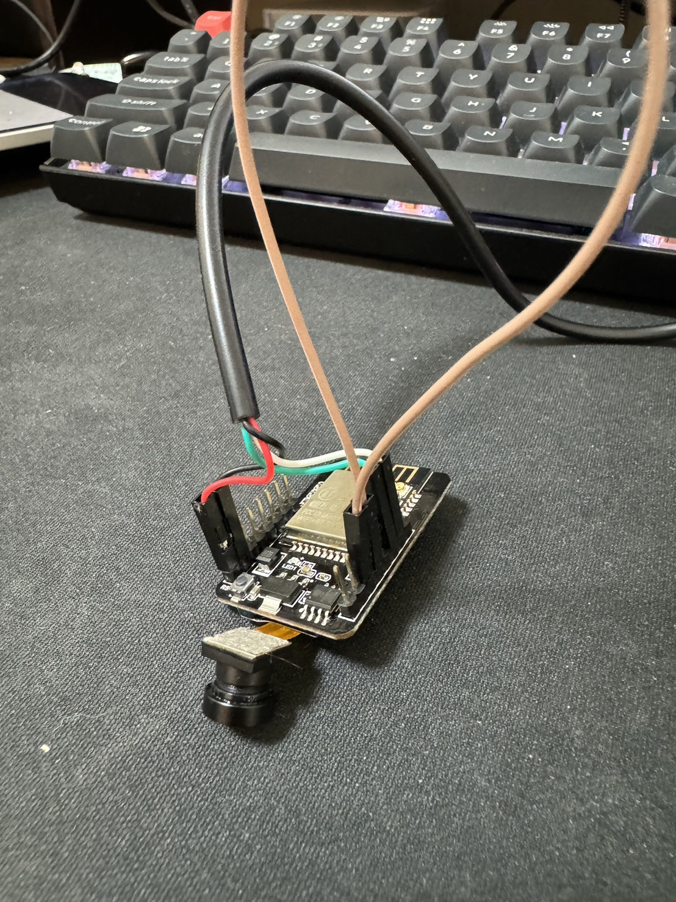

# FJCU_SEDIA_23_IoT
輔大軟創系 專題

# 安裝方式

## 環境
Python 3.9 (Tensorflow不支援3.12)

Windows

## 設定

1. 拷貝專案

```
git clone https://github.com/huawiz/ROS_TrashCane_IoT
```

2. 設定虛擬執行環境(venv)

```
# 建立venv
python -m venv venv
# 使用venv
.\venv\Scripts\Activate.ps1
```

3. 安裝所需modulde

```
pip install -r requirements.txt
```


4. 執行辨識程式

```
python ./app/app.py
```

## 燒錄esp32-cam

原始程式在./esp32/trans_img_by_serial.ino

使用Arduino燒錄時需用杜邦線將IO0和GND連接，燒錄完成再移除

